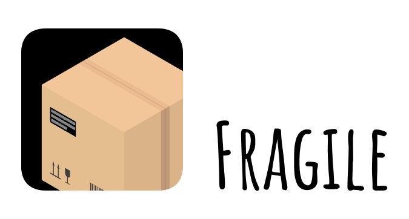

[:book: Study Note](/docs/Note.md)

# Fragile

Fragile is `light-weight` Kotlin Serialization/Deserialization library 
to convert Kotlin(or Java) Objects into JSON and back.

## Table of content

- **`Structure`**
  - [Serialization](/docs/Serialization.md)
  - [Deserialization](/docs/Deserialization.md)
- [Getting started](#getting-started)
- [Documentation](#documentation)
    - [Start Fragile](#start-fragile)
- [Benefits of using Fragile](#benefits)
- [Thanks](#thanks)

## <a id="getting-started"> Getting started

## <a id="documentation"> Documentation

* ## <a id="start-fragile"> Start Fragile

## <a id="benefits"> Benefits of using Fragile

## <a id="thanks"> Thanks
* 