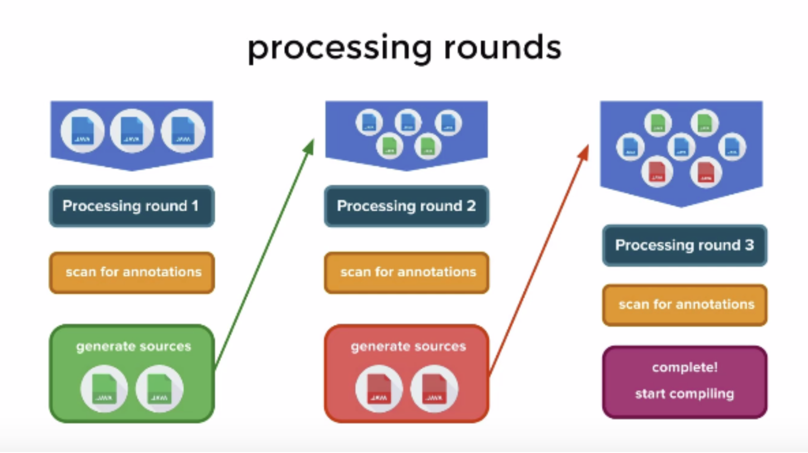
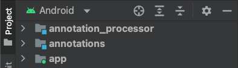
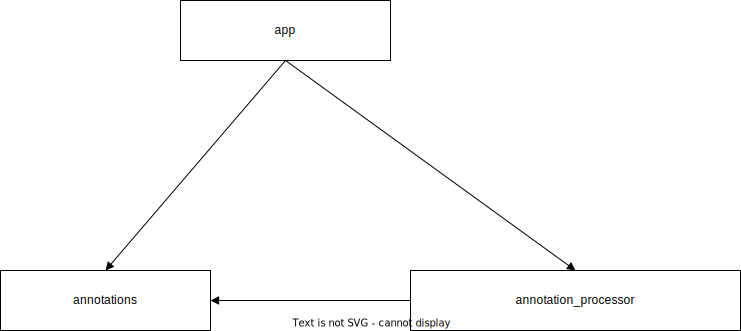

# Annotations & Annotation Processor

## Table of content

- [Annotations](#annotations)
  - [What Are Annotations?](#what-are-annotations)
  - [Declaring Annotation Type](#declaring-annotation-type)
- [Annotation Processor](#annotation-processor)
  - [Processing Rounds](#processing-rounds)
  - [Register Annotation Processor](#register-annotation-processor)

## <a id="annotations"> Annotations

### <a id="what-are-annotations"> What Are Annotations?
- Annotations are human readable.
- Annotations are `compiler readable`.
- Annotations are also `available at runtime` so that a program can read and use it for any purpose it wants.

### <a id="declaring-annotation-type"> Declaring Annotation Type

- **Java**
  ```java
  @Target({ElementType.TYPE, ElementType.CONSTRUCTOR, ElementType.METHOD, ElementType.PACKAGE})
  @Retention(RetentionPolicy.RUNTIME)
  public @interface Version {
      int major() default 0;
      int minor() default 0;
      int patch() default 0;
  }
  ```
- **Kotlin**
  ```kotlin
  @Retention(AnnotationRetention.RUNTIME)
  @Target(AnnotationTarget.TYPE, AnnotationTarget.CONSTRUCTOR,
      /* METHOD */
      AnnotationTarget.FUNCTION, AnnotationTarget.PROPERTY_GETTER, AnnotationTarget.PROPERTY_SETTER,
      /* PACKAGE */
      AnnotationTarget.FILE)
  annotation class Version(
      val major: Int = 0,
      val minor: Int = 0,
      val patch: Int = 0
  )
  ```
  
#### The `Retention` Annotation Type

| Retention | Description |
| --- | --- |
| SOURCE | Source code(= `compile time`) only |
| CLASS | Class file only (the default) |
| RUNTIME | Class file and `runtime` |


## <a id="annotation-processor"> Annotation Processor

[:bookmark_tabs: Java Compilation Overview](https://openjdk.org/groups/compiler/doc/compilation-overview/index.html)

### <a id="processing-rounds"> Processing Rounds



**Annotation processing is performed in `rounds`.** 
An instance of the RoundEnvironment interface represents a round.
The javac compiler calls the `process()` method of your processor by *passing all annotations that processor declares to support and a RoundEnvironment object*.
The return type of the process() method is boolean.
If it *returns true*, the annotations passed to it are considered to be claimed by the processor. 
The claimed annotations are not passed to other processors.
If it *returns false*, the annotations passed to it are considered as not claimed, and other processors will be asked to process them.

### <a id="register-annotation-processor"> Register Annotation Processor

#### Example

