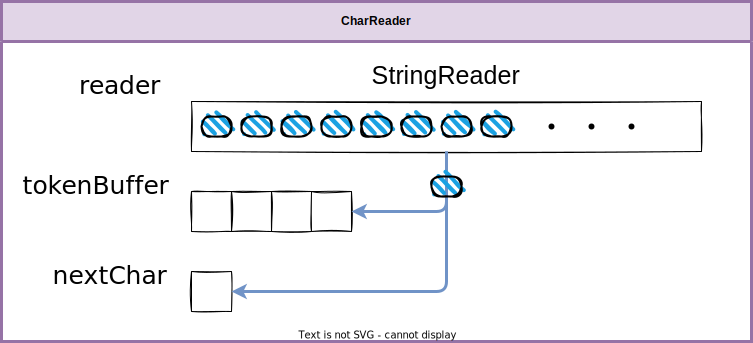
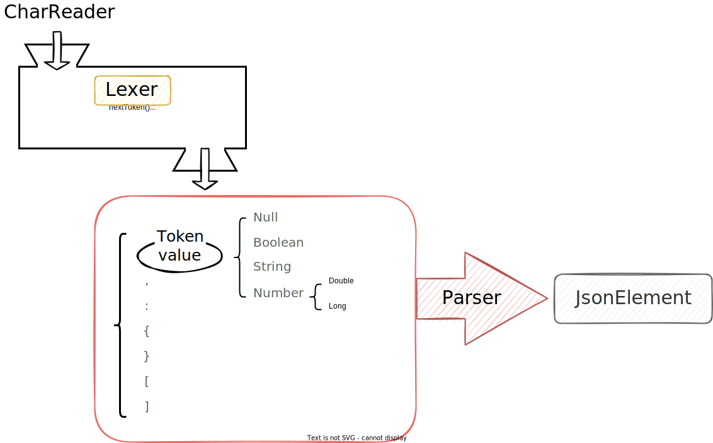

# Deserialization

     
The Kotlin(or Java) Deserialization code is created by referring to the `jkid` library.

## Table of content

- [Structure](#structure)
    - [Tokenizer, Lexer And Parser](#tokenizer-lexer-parser)
    - [CharReader](#char-reader-structure)
- [Deserialize Process](#deserialize-process)

## <a id="structure"> Structure

* ## <a id="tokenizer-lexer-parser"> Tokenizer, Lexer And Parser

    

* ## <a id="char-reader-structure"> CharReader

    

## <a id="deserialize-process"> Deserialize Process

