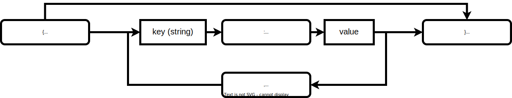
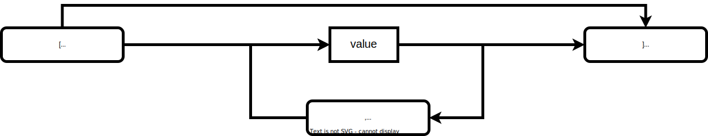
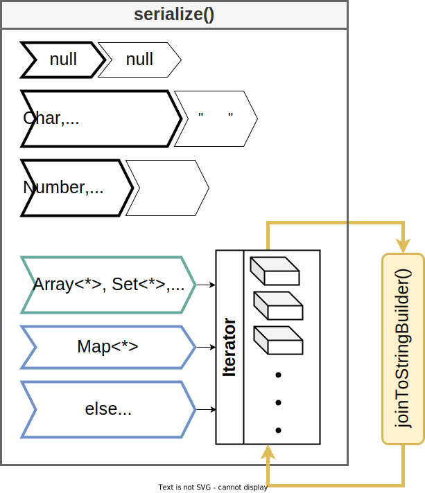

# Serialization

     
The Kotlin(or Java) Serialization code is created by referring to the `jkid` library.

## Table of content

- [Structure](#structure)
    - [Json Object](#json-object-structure)
    - [Json Array](#json-array-structure)
    - [Json Data Types](#json-data-types-structure)
- [Serialize Process](#serialize-process)

## <a id="structure"> Structure

* ## <a id="json-object-structure"> Json Object

    

* ## <a id="json-array-structure"> Json Array

    

* ## <a id="json-data-types-structure"> Json Data Types

  | Data Type | Json String |
  | --- | --- |
  | String | `"`FRAGILE`"` |
  | Number | 1234 |
  | Object | [`Json Object`](#json-object-structure) |
  | Array | [`Json Array`](#json-array-structure) |
  | Boolean | true/false |
  | Null | null |

## <a id="serialize-process"> Serialize Process

(📂 `fragile/src/main/java/kr/pokeum/fragile/serialization/Serializer.kt`)

